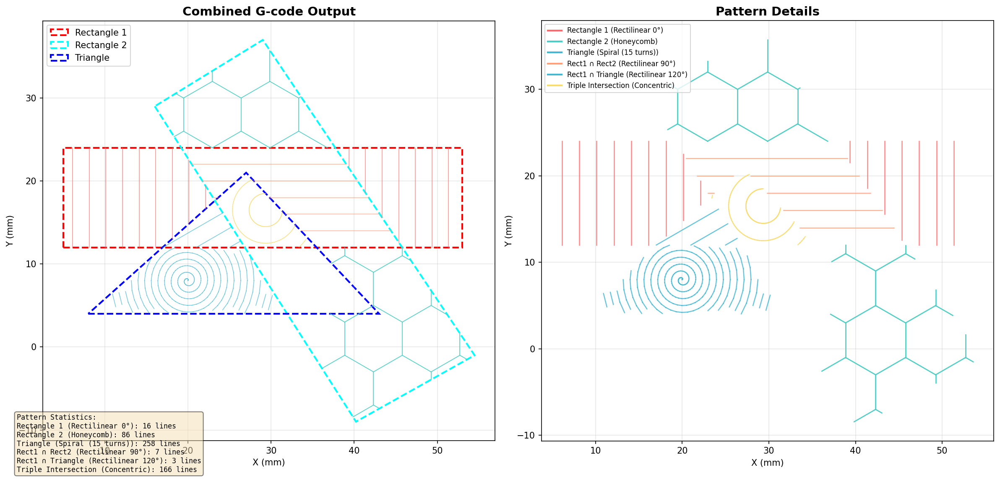

# Geometry Patterns Generator

Generator of geometric patterns in **G-code** from 3 base polygons:

- Rectangle 1
- Rectangle 2
- Triangle

The program calculates intersections/differences between regions and applies a different pattern per zone.

---

## Preview




---

## Project Architecture

### Main Components

- **`GeometryProcessor`**
  - Boolean operations between polygons (intersection, difference, triple intersection).
  - Based on Clipper2.

- **`IPattern`** (interface)
  - Common contract: `generate(const Polygon&)` and `name()`.

- Concrete patterns:
  - **`RectilinearPattern`** (configurable rotation, e.g. 0°, 90°, 120°)
  - **`HoneycombPattern`**
  - **`SpiralPattern`**
  - **`ConcentricPattern`**

- **`GCodeGenerator`**
  - Builds G-code output per region.
  - Supports normal and travel segments (`is_travel`).

- **`main.cpp`**
  - Defines input geometries.
  - Calculates regions:
    - exclusive zones (`r1Only`, `r2Only`, `tOnly`)
    - double intersections without triple (`intR1R2Only`, `intR1TOnly`, `intR2TOnly`)
    - triple intersection (`intAll`)
  - Assigns pattern to each region and exports `output_patterns.gcode`.

---

## Current Pattern Assignment

- `Rectangle 1` → Rectilinear 0°
- `Rectangle 2` → Honeycomb
- `Triangle` → Spiral
- `Rect1 ∩ Rect2` → Rectilinear 90°
- `Rect1 ∩ Triangle` → Rectilinear 120°
- `Triple Intersection` → Concentric

---

## Requirements

- Linux
- `g++` with C++17
- `cmake` (>= 3.15 recommended)
- Clipper2

Basic installation on Ubuntu/Debian:

```bash
sudo apt update
sudo apt install -y build-essential cmake
```

### Clipper2 Installation

Install Clipper2 from the official GitHub repository:

```bash
# Clone the Clipper2 repository
git clone https://github.com/AngusJohnson/Clipper2.git
cd Clipper2/CPP

# Build and install
cmake .
cmake --build . --config Release
sudo cmake --install .
```

For more information, visit:
- **Official Repository:** [Clipper2 GitHub](https://github.com/AngusJohnson/Clipper2)
- **Documentation:** [Clipper2 Documentation](https://www.angusj.com/clipper2/Docs/Overview.htm)

---

## Build

From the project root:

```bash
mkdir -p build
cd build
cmake ..
make -j$(nproc)
```

---

## Execution

```bash
cd build
./geometry_patterns
```

Expected output:
- G-code file: `output_patterns.gcode` (in project root or cwd depending on implementation)
- Message: `✓ Generation complete!`

---

## Folder Structure (summary)

```text
include/
  core/Types.hpp
  GeometryProcessor.hpp
  GCodeGenerator.hpp
  patterns/
    IPattern.hpp
    RectilinearPattern.hpp
    HoneycombPattern.hpp
    SpiralPattern.hpp
    ConcentricPattern.hpp

src/
  main.cpp
  GeometryProcessor.cpp
  GCodeGenerator.cpp
  patterns/
    IPattern.cpp
    RectilinearPattern.cpp
    HoneycombPattern.cpp
    SpiralPattern.cpp
    ConcentricPattern.cpp
```

---

## Technical Notes

- To avoid duplicate fills in overlapping zones, use `FillRule::NonZero` and unify clippings before `Difference`.
- `std::vector` already reserves data in heap internally; `unique_ptr` is used for safe lifecycle of polymorphic objects.
- If patterns are very dense, consider:
  - increasing `line_spacing`
  - reducing angular resolution (spiral/concentric)
  - simplifying polygons before generating paths.

---